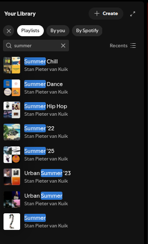
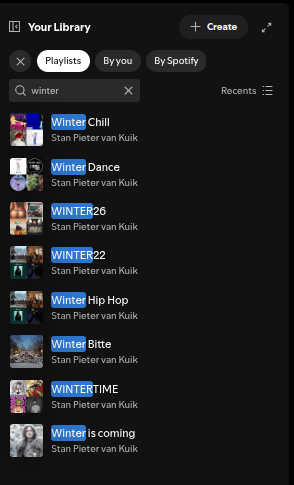

## Background

Over the last couple of years, I have noticed that my listening behavior seems to be divided quite strongly by season, especially between summer and winter. I also tend to organize my favorite kinds of music into separate playlists, mainly dance music, hip hop, and chill music that I listen to in order to relax. This made me curious whether that seasonal pattern is actually reflected in the music itself, or whether it is mainly just a feeling.

::: {layout-ncol=2}
{fig-alt="Screenshot of my summer playlists"}

{fig-alt="Screenshot of my winter playlists"}
:::

This portfolio is based on a personal corpus of six playlists that reflect my own listening habits across both season and genre. More specifically, I selected separate winter and summer playlists for dance, hip hop, and chill music. I chose these tracks because they represent music that I actually listen to regularly, while at the same time creating a corpus with a clear internal structure for comparison. This makes it possible to study not only broad seasonal differences in my listening behavior, but also whether those differences appear in similar or different ways across genres.

The dashboard is intended to answer a number of related questions. First, it explores whether my winter and summer playlists differ in measurable ways through Spotify variables such as energy, valence, tempo, acousticness, speechiness, and popularity. Second, it examines whether these seasonal differences are consistent across dance, hip hop, and chill music, or whether each genre shows its own distinct pattern. In this way, the portfolio combines a personal listening context with broader computational questions about musical style, mood, and structure.

## Portfolio structure

The portfolio is organized in several steps. It begins with a general exploration of the corpus using Spotify track-level features. After that, I will examine the corpus in more detail through feature-specific analyses, focusing on chroma features, loudness, timbre features, and temporal features. These analyses move from a broad overview toward more detailed musical representations.

After the feature analyses, I will return to the corpus as a whole. At that stage, I will use classification investigate whether broader computational patterns can be identified across the playlists and seasons. Finally, I will reflect on what I have learned from the analysis and draw conclusions about the corpus as a whole.